# System Architecture Documentation

## Architecture Overview

This project implements a client-side documentation generator built with React and modern web technologies. The architecture follows a component-based design pattern with clear separation of concerns.

## System Architecture Diagram

```mermaid
graph TB
    subgraph "User Interface Layer"
        UI[📱 User Interface]
        MAIN[🏠 Main Page - Index.tsx]
        NAV[🧭 Tab Navigation]
        PREVIEW[👁️ Live Preview]
    end

    subgraph "Documentation Components"
        OVERVIEW[📄 Project Overview]
        PERSONAS[👥 User Personas]
        FEATURES[⚙️ Feature Specs]
        DESIGN[🎨 Design Assets]
        API[🔌 API Documentation]
        DATABASE[🗄️ Database Schema]
        ENV[🌍 Environment Setup]
        TESTING[🧪 Testing Guidelines]
        DEPLOY[🚀 Deployment Instructions]
        VERSION[📋 Version Control]
        SECURITY[🔒 Security Practices]
        COMPLIANCE[✅ Compliance Requirements]
    end

    subgraph "UI Component Library"
        SHADCN[🎯 shadcn/ui Components]
        FORMS[📝 Form Components]
        LAYOUT[📐 Layout Components]
        FEEDBACK[💬 Feedback Components]
    end

    subgraph "State Management"
        STATE[🔄 React State]
        HOOKS[🎣 Custom Hooks]
        CONTEXT[🌐 Context API]
    end

    subgraph "Data Layer"
        STORAGE[💾 Local Storage]
        EXPORT[📤 Markdown Export]
        VALIDATION[✔️ Form Validation]
    end

    subgraph "Build & Development"
        VITE[⚡ Vite Build Tool]
        TS[📘 TypeScript]
        TAILWIND[🎨 Tailwind CSS]
        ESLINT[📏 ESLint]
    end

    %% User Flow
    UI --> MAIN
    MAIN --> NAV
    NAV --> OVERVIEW
    NAV --> PERSONAS
    NAV --> FEATURES
    NAV --> DESIGN
    NAV --> API
    NAV --> DATABASE
    NAV --> ENV
    NAV --> TESTING
    NAV --> DEPLOY
    NAV --> VERSION
    NAV --> SECURITY
    NAV --> COMPLIANCE

    %% Component Dependencies
    OVERVIEW --> SHADCN
    PERSONAS --> SHADCN
    FEATURES --> SHADCN
    DESIGN --> SHADCN
    API --> SHADCN
    DATABASE --> SHADCN
    ENV --> SHADCN
    TESTING --> SHADCN
    DEPLOY --> SHADCN
    VERSION --> SHADCN
    SECURITY --> SHADCN
    COMPLIANCE --> SHADCN

    %% State Management
    OVERVIEW --> STATE
    PERSONAS --> STATE
    FEATURES --> STATE
    DESIGN --> STATE
    API --> STATE
    DATABASE --> STATE
    ENV --> STATE
    TESTING --> STATE
    DEPLOY --> STATE
    VERSION --> STATE
    SECURITY --> STATE
    COMPLIANCE --> STATE

    %% Preview and Export
    STATE --> PREVIEW
    PREVIEW --> EXPORT
    STATE --> STORAGE

    %% UI Library Structure
    SHADCN --> FORMS
    SHADCN --> LAYOUT
    SHADCN --> FEEDBACK

    %% Build Pipeline
    MAIN --> VITE
    VITE --> TS
    VITE --> TAILWIND
    VITE --> ESLINT

    %% Styling
    style UI fill:#e1f5fe
    style MAIN fill:#f3e5f5
    style SHADCN fill:#e8f5e8
    style STATE fill:#fff3e0
    style VITE fill:#ffebee
```

## Component Descriptions

### 🏠 **Main Page (Index.tsx)**
The central hub orchestrating the entire documentation generation experience. Manages global state, tab navigation, and coordinates between all documentation sections and the live preview system.

### 📱 **User Interface Layer**
Provides the primary interaction surface with responsive design, tab-based navigation, and real-time preview capabilities. Built with accessibility and user experience as core priorities.

### 📋 **Documentation Components (12 sections)**
Specialized form components each handling a specific aspect of project documentation. Each component manages its own local state while contributing to the global documentation object through controlled updates.

### 🎯 **shadcn/ui Component Library**
Comprehensive, accessible UI component system providing consistent design language. Includes form controls, layout components, navigation elements, and feedback mechanisms all built on Radix UI primitives.

### 🔄 **State Management**
React-based state management using hooks and context for sharing data between components. Handles form data persistence, validation states, and real-time preview updates.

### 💾 **Data Layer**
Client-side data persistence using browser local storage, form validation, and markdown export functionality. No server-side dependencies required for core functionality.

### ⚡ **Build & Development Tools**
Modern development stack with Vite for fast builds, TypeScript for type safety, Tailwind CSS for styling, and ESLint for code quality enforcement.

## Data Flow Architecture

## Security & Performance Considerations

### 🔒 **Security**
- Client-side only architecture eliminates server-side vulnerabilities
- No external API dependencies reduce attack surface
- Form input sanitization through controlled components
- Local storage for data persistence (user-controlled)

### ⚡ **Performance**
- Component lazy loading for optimal bundle size
- Efficient React re-renders through proper state management
- Tree-shaking enabled for minimal production builds
- CSS-in-JS avoided in favor of Tailwind for better performance

### 🌐 **Scalability**
- Modular component architecture for easy feature additions
- Type-safe interfaces for reliable component integration
- Consistent design system for rapid UI development
- Export functionality enables integration with external documentation systems

## Technology Stack Summary

| Layer | Technology | Purpose |
|-------|------------|---------|
| **Frontend Framework** | React 18 | Component-based UI development |
| **Build Tool** | Vite | Fast development and optimized builds |
| **Language** | TypeScript | Type safety and developer experience |
| **Styling** | Tailwind CSS | Utility-first CSS framework |
| **UI Components** | shadcn/ui | Accessible, customizable component library |
| **Routing** | React Router | Client-side navigation |
| **State Management** | React Hooks | Built-in state management |
| **Code Quality** | ESLint | Linting and code standards |
| **Package Manager** | npm | Dependency management |
